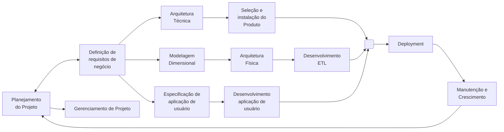

# Cubo

 o cubo é criado tendo-se em mente o tipo de consulta que o gerente de projetos pode querer fazer.  Ao projetar o cubo é importante levar em conta as prováveis consultas que poderão ser feitas no cubo, porém não se deve perder de vista que existem muitas consultas potenciais que podem surgir.  portanto, o projeto de um cubo deve priorizar a escolha e ergo Organização das dimensões que podem influenciar nas medidas relacionadas à decisão que o usuário deve tomar. A escolha das dimensões é fundamental no projeto de um cubo.

## Arquiteturas OLAP

- HOLAP: acessam tanto os dados relacionais quanto os multidimensionais
  - Alto desempenho
  - Alta escalabilidade
  - Arquitetura de maior custo
- DOLAP: desenvolvidos para computadores pessoais (desktop)
  - Pouco tráfego na rede
  - Sem sobrecarregar o servidor de banco de dados
  - Limitação do cubo de dados
- MOLAP: acessam dados multidimensionais por meio de cubos
  - Armazenamento dos dados em cubos dimensionais
  - Alto desempenho
  - Execução de cálculos complexos
  - Baixa escalabilidade
  - Investimentos altos
- ROLAP: acessam bancos de dados integrados (relacionais)
  - Alta escalabilidade
  - Pode alavancar as funcionalidades inerentes do banco de dados relacional
  - Baixo desempenho

## Operações OLAP

- Alternar linhas e colunas, sendo que todos os valores totalizados serão recalculados. 
- Aumento do nível de detalhe da informação e conseqüente diminuição do nível de granularidade. 
- Corta o cubo, mas mantém a mesma perspectiva de visualização dos dados.
- Diminuição no nível de detalhe e conseqüente aumento do nível de granularidade.
- Mudança de perspectiva da visão multidimensional, como se o cubo fosse girado.

## Tipos de Operações OLAP

- DRILL Down: Usuário aumenta o nível de detalhe da informação, diminuindo a granularidade Ela influencia diretamentena velocidade do acesso às informações e no volume de dados armazenados
  - Exemplo: Estado para Cidade
- DRILL UP: Exatamente o contrário do Drill Down, ocorre quando o usuário aumenta agranularidade, diminuindo o nível de detalhamento da informação
  - Exemplo: Cidade para Estado
- DRILL Across: Ocorre quando o usuário pula um nível intermediário dentro de uma mesma dimensão
  - Exemplo: Cidade direto para País
- DRILL Throught: Ocorre quando o usuário passa de uma informação contida em uma dimensão para uma outra.
  - Exemplo: Inicia na dimensão do tempo e no próximo passo analisa a informação por Estado
- PIVOT: Girar o cubo
- ROLL-UP: DRILL UP
- DICE: Pinça um grupo de cubos
- Slice: Fatia uma Cinha, Coluna ou Fundo

## Ciclo de Vida Projeto Dados

## Passos de construção OLAP

1. Início: ETL pronto
2. Definir padrões para metadados, consultas, relatórios e gráficos para a ferramenta definida de OLAP/Report
3. Definir padrões e infra-estrutura para OLAP
4. Entrevista com os usuários chave
5. Especificar OLAP
6. Construir OLAP
7. Fim: Publicar OLAP

## Entrevista com usuários chave

Objetivo: Entender, através de uma rápida entrevista, a área, seus principais processos e as necessidades de extração de informações.

1. Apresentação dos participantes
2. Revisão dos objetivos do projeto
3. Indagações e discussões com base no roteiro de entrevista
4. Descrição dos próximos passos após a entrevista
5. Encerramento da entrevista

## Especificação técnica

- Fazer o Dashboard
- Definir para cada KPI se terá Card, Gráfico de Linhas, Mapas, Barras, Pizza
- Definir padrão de cores
- Criar Temas

## Ferramentas OLAP

- Quadrante Mágico Gartner
- IBM Cognos
- SAP - Busisness Object
- Oracle - Busisness Inteligence
- Pentaho (free)
- MicroStrategy
- ThoughtSpot (*)
- QLIK (**)
- Tableau (*** para dados)
- Power BI (***)

## Quadrante Mágico Gartner

O quadrante mágico Gartner é um relatório anual disponibilizado pelo Grupo Gartner. Ele dá um panorama das empresas que compõem o mercado tecnológico, apontando os líderes, os desafiantes, os visionários e os competidores de nicho.

O quadrante mágico Gartner é uma representação gráfica das atividades do mercado tecnológico em um determinado período de tempo. A partir da coleta de dados de empresas do setor, o grupo divulga, ano a ano, uma relação dos 24 agentes mais relevantes do mercado.

Estar posicionado entre os primeiros colocados dessa relação gera uma credibilidade inigualável para o negócio.

Contudo, mesmo que o seu nome não figure na lista, o relatório é muito útil para o desenvolvimento e aprimoramento da sua abordagem estratégica. Para nos aprofundarmos nesse ponto, vamos entender como funciona a estrutura do quadrante. Siga a leitura!

### Como funciona o quadrante mágico Gartner?

Um dos fatores que tornam essa ferramenta tão eficaz e popular é sua simplicidade. O quadrante é estruturado em um gráfico de dispersão, que utiliza dois eixos para separar os nomes incluídos na análise.

O eixo horizontal, representado pela letra X, mostra a abrangência da visão da companhia em relação ao mercado de tecnologia. Para definir o posicionamento nesse eixo, o quadrante utiliza 8 critérios, que você pode conferir a seguir:

- entendimento do mercado: habilidade da empresa de entender as necessidades do cliente e oferecer soluções adequadas;
- estratégia de marketing: eficiência dos esforços de comunicação da empresa, tanto offline quanto online;
- estratégia de vendas: as práticas adotadas pela empresa para desenvolver uma base de consumidores;
- estratégia de abordagem: as técnicas utilizadas pela companhia para possibilitar a distribuição e desenvolvimento de um produto;
- modelo de negócios: a eficácia e consistência da proposta do negócio para dominar uma parcela do mercado;
- estratégia de indústria: a habilidade do negócio em satisfazer as necessidades de nichos específicos do mercado;
- inovação: nível de investimento e expertise em soluções que possibilitem a criação de vantagens competitivas;
- estratégica geográfica: habilidade do negócio em satisfazer as necessidades de regiões geográficas importantes para o mercado.

Já o eixo vertical, que utiliza a letra Y, indica a capacidade de execução da empresa naquilo a que ela se propõe. Para posicionar cada nome, o Gartner emprega mais 7 critérios, que incluem os seguintes:

- produtos e serviços: qualidade, funcionalidades e nível de diferenciação do mix de produtos e serviços oferecidos;
- viabilidade: relação entre os custos envolvidos nas operações e a sustentabilidade financeira apresentada pela empresa;
- vendas e precificação: habilidade da empresa para encontrar estratégias eficientes de venda, incluindo a eficácia da precificação;
- responsividade ao mercado: capacidade do negócio de se adaptar às diferentes situações apresentadas pelo mercado;
- execução de marketing: a qualidade, criatividade e efetividade da empresa em comunicar sua mensagem ao consumidor;
- experiência do consumidor:o nível de satisfação do consumidor em relação ao serviço oferecido pela marca;
- operações: a habilidade da empresa em atingir suas metas e objetivos.
