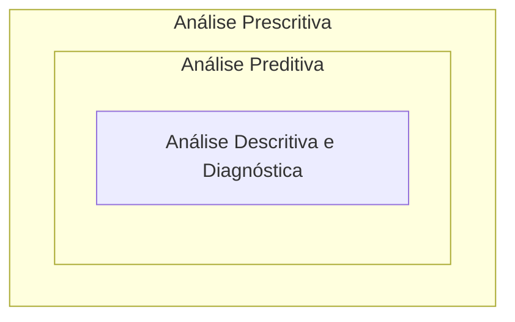
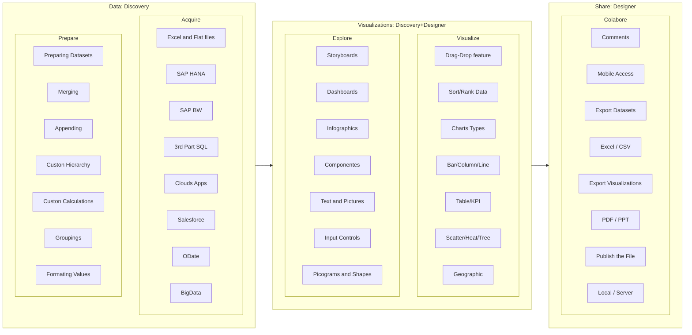
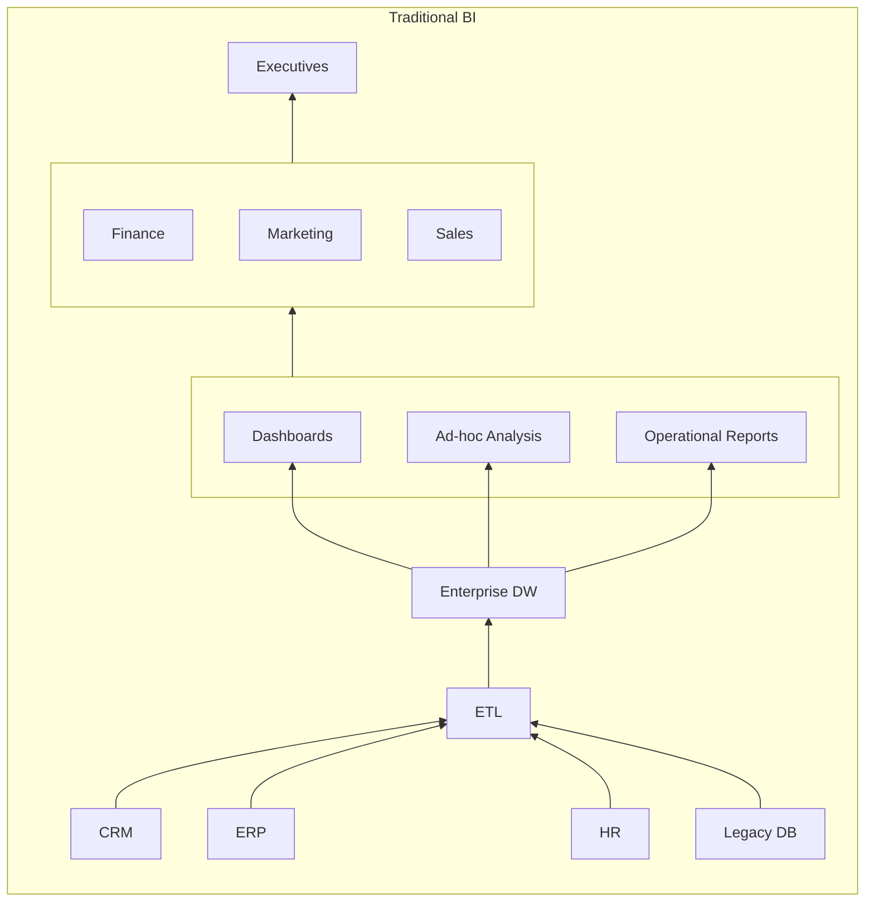
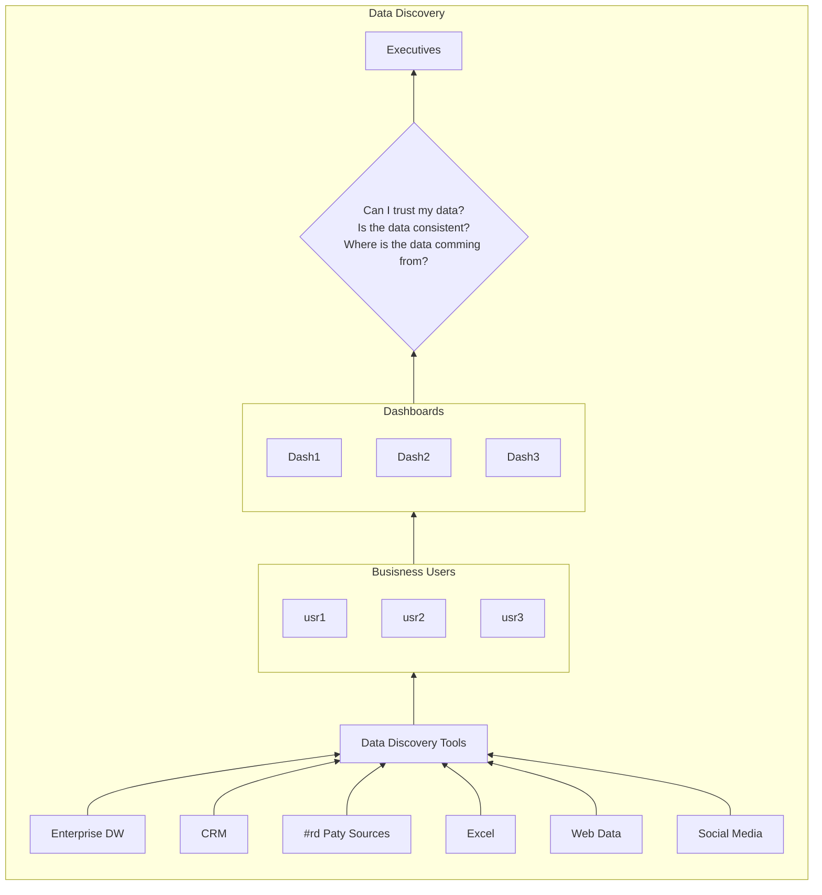

# DATA DISCOVERY E ANALYTICS 

Conceitos e aplicações 

Data Discovery

## O que é Data Discovery e Analytics?

- Permite que os usuários desenvolvam e refinem visualizações e análises de dados estruturados e não estruturados usando termos de pesquisa.
- Possibilita que as áreas de negócio utilizem dados relevantes em modo “self-service” e em todo lugar – a ferramenta fornece ao usuário flexibilidade na composição e utilização das informações, acessados de tablets e smartphones, sem a necessidade de relatórios pré-definidos e estáticos, que normalmente demoram muito tempo para serem desenvolvidos e que criam uma alta dependência do setor de TI.
- Sem a necessidade de criar relatórios pré-definidos, como anteriormente, é possível levar a análise de informações para todos os setores e camadas das empresas.

## Etapas de Data Discovery

- Visualização de dados
- Descoberta destas informações
- Influência nos negócios (momento em que a análise reflete em ações) 
- Análise preditiva

> **Varejo**: Soluções de Data Discovery ajudam a mapear o comportamento dos consumidores e, assim, as companhias conseguem planejar ações de marketing e promoções mais assertivas para os seus públicos-alvo.

## Análise Descritiva e Diagnóstica

- Monitorar e Interpretar KPIs através de dados históricos
- Normalmente a pergunta é O que?
  - Ajudar entender o porque estamos neste ponto
- Permite investigar os dados para detectar a causa raiz do problema.
- Normalmente a pergunta é Por quê?

## Análise Preditiva

- Utilização de dados históricos para prever eventos futuros.
- Normalmente a pergunta é O que vai acontecer?

Avaliar de forma preditiva significa tomar como referência dados do passado e do presente para, a  partir deles, formular prognósticos. Esse tipo de análise serve para trazer respostas tanto para questões já conhecidas quanto para  aquelas que você nem desconfiava que existiam.

Isso porque, ao avaliar o negócio de maneira preditiva, a empresa se habilita a ver ainda mais longe,  se valendo de recursos e técnicas especiais.

## Análise Prescritiva

- Recomendações de ações a serem tomadas
- Normalmente a pergunta é O que devo fazer?

Recomendação da Gartner:

“Usar Business Intelligence e Data Discovery ao mesmo tempo é o ideal.”

## Vantagens Data Discovery

- Qualquer um que entenda a correlação entre os dados sendo utilizados pode fazer perguntas de negócios.
- Análises exploratórios ao alcance com uma ferramenta de descoberta de dados intuitiva, interativa e visual (fácil navegação pelos usuários).
- A libertação dos dados e a entrega de informações críticas automatizada.
- Extremamente social e pode integrar todos os membros da organização em torno dos mesmos objetivos.

