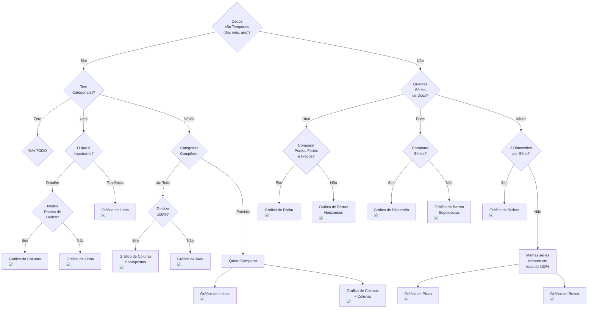
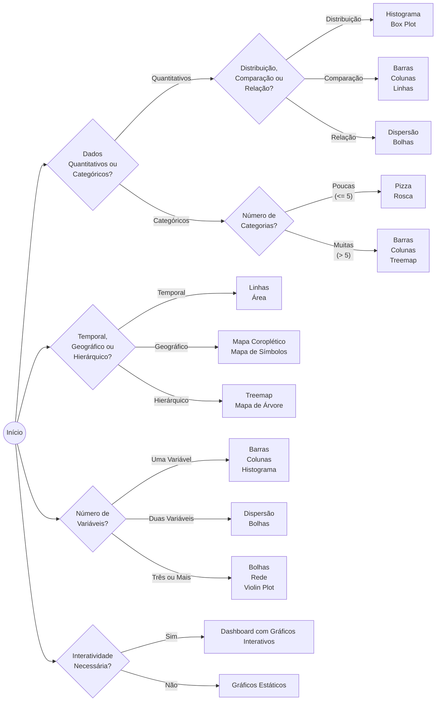

# Qual Gráfico Usar?

## Power BI

1. **Gráfico de Barras (Bar Chart)**: Mostra comparações entre diferentes categorias. Pode ser horizontal ou vertical (gráfico de colunas).
2. **Gráfico de Colunas (Column Chart)**: Similar ao gráfico de barras, mas as barras são verticais.
3. **Gráfico de Linhas (Line Chart)**: Mostra tendências ao longo do tempo conectando pontos de dados com linhas.
4. **Gráfico de Pizza (Pie Chart)**: Mostra a proporção de categorias em um todo, dividido em fatias.
5. **Gráfico de Área (Area Chart)**: Similar ao gráfico de linhas, mas as áreas sob as linhas são preenchidas.
6. **Gráfico de Dispersão (Scatter Chart)**: Mostra a relação entre duas variáveis numéricas usando pontos no gráfico.
7. **Gráfico de Bolhas (Bubble Chart)**: Extensão do gráfico de dispersão, onde o tamanho dos pontos reflete uma terceira variável.
8. **Histograma**: Mostra a distribuição de dados dividindo em intervalos (bins).
9. **Gráfico de Rosca (Donut Chart)**: Similar ao gráfico de pizza, mas com um centro vazio.
10. **Gráfico de Cascata (Waterfall Chart)**: Mostra a contribuição individual para o total acumulado ao longo de uma sequência.
11. **Gráfico de Funil (Funnel Chart)**: Mostra um processo em fases, com cada fase representando uma parte do total.
12. **Gráfico de Ponto (Dot Plot)**: Mostra a distribuição de uma ou mais variáveis usando pontos.
13. **Mapa de Calor (Heatmap)**: Mostra os dados em uma matriz colorida, onde as cores representam valores.
14. **Gráfico de Gantt**: Usado para mostrar cronogramas de projetos.
15. **Gráfico de Rede (Network Chart)**: Mostra conexões e interações entre diferentes entidades.
16. **Gráfico de Radar (Radar Chart)**: Mostra múltiplas variáveis em torno de um ponto central.
17. **Mapa Coroplético (Choropleth Map)**: Mapa onde áreas são coloridas de acordo com um valor.
18. **Gráfico de Linhas Empilhadas (Stacked Line Chart)**: Similar ao gráfico de linhas, mas as linhas são empilhadas.
19. **Gráfico de Barras Empilhadas (Stacked Bar Chart)**: Similar ao gráfico de barras, mas as barras são empilhadas.
20. **Sankey Chart**: Mostra o fluxo de dados de uma categoria para outra com larguras variáveis.

## Excel

1. **Gráfico de Colunas**: Usado para mostrar comparações entre diferentes itens.
2. **Gráfico de Linhas**: Mostra tendências ao longo do tempo.
3. **Gráfico de Barras**: Gráfico de colunas orientado horizontalmente.
4. **Gráfico de Pizza**: Mostra a proporção de partes de um todo.
5. **Gráfico de Área**: Gráfico de linhas com áreas preenchidas.
6. **Gráfico de Dispersão**: Mostra a correlação entre duas variáveis.
7. **Gráfico de Bolhas**: Gráfico de dispersão com tamanhos variados de bolhas.
8. **Histograma**: Mostra a distribuição de dados dividida em intervalos.
9. **Gráfico de Rosca**: Similar ao gráfico de pizza, mas com um buraco no meio.
10. **Gráfico de Cascata**: Mostra a contribuição incremental para um total.
11. **Gráfico de Superfície (Surface Chart)**: Mostra uma superfície 3D que conecta dados ao longo de um grid.
12. **Gráfico de Radar**: Mostra variáveis múltiplas em uma grade radial.
13. **Gráfico de Pareto**: Tipo de gráfico de colunas combinado com um gráfico de linhas que mostra a frequência dos valores.
14. **Gráfico de Caixas e Bigodes (Box and Whisker)**: Mostra a distribuição dos dados com quartis e mediana.
15. **Mapa de Árvores (Treemap)**: Mostra hierarquias com retângulos aninhados.
16. **Gráfico de Funil**: Mostra fases de um processo, cada uma representando um total menor.
17. **Mapa (Map Chart)**: Mapa que mostra dados geograficamente.

## Tableau

1. **Gráfico de Barras**: Usado para comparações entre categorias.
2. **Gráfico de Linhas**: Mostra tendências ao longo do tempo.
3. **Gráfico de Pizza**: Mostra proporções em um círculo dividido.
4. **Histograma**: Distribuição dos dados em intervalos.
5. **Gráfico de Dispersão**: Relaciona duas variáveis numéricas com pontos.
6. **Gráfico de Mapa**: Mostra dados geográficos em um mapa.
7. **Gráfico de Bolhas**: Similar ao gráfico de dispersão, com tamanhos variáveis para bolhas.
8. **Mapa de Calor**: Matriz de cores representando valores.
9. **Gráfico de Barras Empilhadas**: Mostra a composição das categorias.
10. **Treemap**: Mostra hierarquias usando retângulos de tamanhos variados.
11. **Mapa de Árvore**: Representa dados hierárquicos com cores e tamanho.
12. **Gráfico de Gantt**: Usado para cronogramas e planejamento de projetos.
13. **Gráfico de Pareto**: Combinação de barras e linhas, mostrando a distribuição cumulativa.
14. **Gráfico de Rede (Network Graph)**: Visualiza interações e conexões entre diferentes entidades.
15. **Mapa de Símbolos**: Usa símbolos em vez de áreas preenchidas para representar valores em um mapa.
16. **Gráfico de Caixas e Bigodes**: Representa a distribuição estatística dos dados.
17. **Sankey Diagram**: Visualiza fluxos de dados ou processos.
18. **Gráfico de Violin (Violin Plot)**: Mostra a distribuição dos dados em torno de uma mediana.

