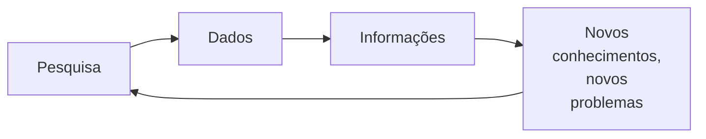
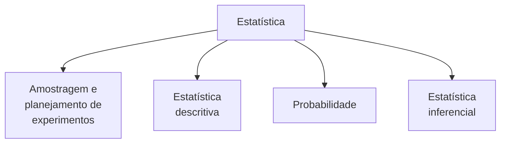
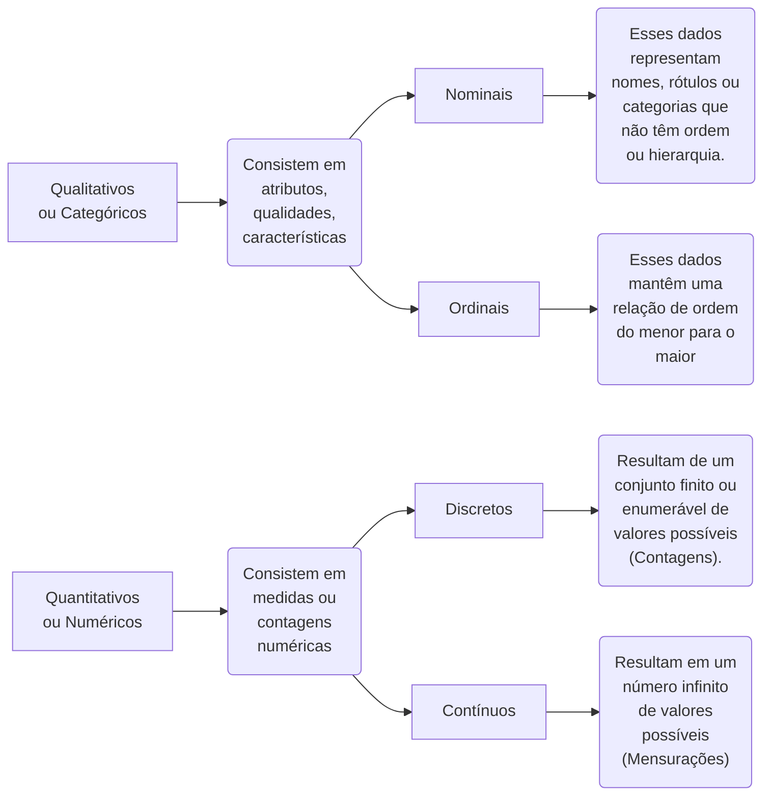

# Introdução

População:
: População é definido pelo principal alvo de interesse para fazer uma pesquisa.  eu defino o objetivo e a partir daí eu defino qual é a população que eu devo estudar para satisfazer esse objetivo.
: Geralmente não conseguimos estudar toda a população.
: Avaliar a quantidade de itens que compõem essa população como pessoas, produtos, serviços etc
: Se a população for grande demais selecionamos uma Amostra

Amostra:
: É um subconjunto de itens da população que fazem parte do objeto de estudo

Parâmetros:
: São  todas as informações que são extraídas da população  por meio de percentuais, médias ou outras medidas que fazem parte do objeto de estudo
: Dados conseguidos de uma população São considera como parâmetros seja ele percentuais, medidas etc

Estatísticas:
: São cálculos baseados na amostra

## Objetivo e método da Estatística

A estatística envolve técnicas para coletar, organizar, descrever, analisar e interpretar dados provenientes de experimentos ou vindos de outros estudos observacionais.

- Estudo observacional: É aquele em que as características de uma população são levantadas (observadas ou medidas), mas sem manipulação. É o caso de um censo demográfico, pesquisas eleitorais, pesquisas de mercado, inspeção da qualidade, etc. Em todos esses casos, quer-se ter a idéia de certa população tal qual ela é na natureza ou no processo.
- Estudo experimental: É aquele em que grupos de indivíduos (ou animais, ou objetos) são manipulados para se avaliar o efeito de diferentes tratamentos. É o caso de se verificar o rendimento de um processo químico para diferentes temperaturas de reação, que são manipuladas de acordo com o interesse prático.

A análise estatística de dados geralmente tem por objetivo tomadas de decisões, resoluções de problemas ou produção de conhecimento. Mas novos conhecimentos normalmente geram novos problemas de pesquisa, resultando em um processo interativo:



## Grandes áreas da Estatística



- Amostragem e planejamento de experimentos
  - É o processo de escolha da amostra.
  - É a parte inicial de qualquer estudo estatístico. Consiste na escolha criteriosa dos elementos a serem submetidos ao estudo.
  - Podemos citar alguns métodos de amostragem: aleatória simples, sistemática, estratificada, por conglomerado, entre outras
    > “Em épocas de eleição, é comum a realização de pesquisas com o objetivo de se conhecerem as tendências do eleitorado. Para que os resultados sejam, de fato, representativos, toma-se o cuidado de entrevistar um conjunto de pessoas com características sócio-econômicas, culturais, religiosas, etc. tão próximas quanto possível da população à qual os resultados da pesquisa serão estendidos. A escolha da amostra, a redação do questionário, a entrevista, a codificação dos dados, a apuração dos resultados são etapas fundamentais deste tipo de pesquisa.”
- Estatística descritiva
  - É a parte mais conhecida.
  - Compreende a organização, o resumo e, em geral, a simplificação de informações que podem ser muito complexas.
  - Quem vê o noticiário na televisão ou nos jornais ou sites de informação, sabe quão frequente é o uso de médias, índices e gráficos nas notícias

- Probabilidade
  - É a teoria matemática utilizada para se estudar a incerteza oriunda de fenômenos de caráter aleatório. •Fornece a base para os métodos que utilizamos quando fazemos generalizações a partir de dados observados
- Estatística inferencial
  - A tomada de decisões sobre a população, com base em estudos feitos sobre os dados da amostra, constitui o problema central da inferência estatística.
  - As decisões sobre a população estão sempre associadas a um grau de incerteza e, conseqüentemente, uma probabilidade de erro.•A generalização da amostra para a população é feita por meio do modelo estatísticos que melhor se ajusta a situação em estudo.

## Tipos de dados



```mermaid
flowchart LR

```

```mermaid
flowchart LR

```

```mermaid
flowchart LR

```
