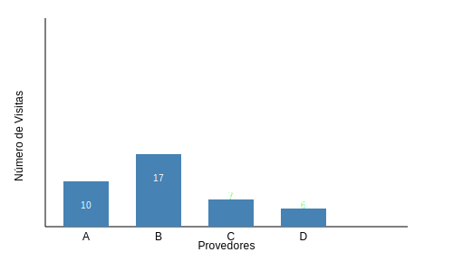

# Gráficos

“Enquanto as tabelas interagem com nosso sistema verbal, os gráficos interagem com nosso sistema visual, que é mais rápido no processamento de informações. Isso significa que um gráfico bem projetado normalmente comunicará a informação mais rápido que uma tabela bem projetada.“

## Gráfico de setores

- É um gráfico muito comum para representar distribuições de frequências de variáveis qualitativas.
- É particularmente útil quando o número de categorias não é grande e as categorias não obedecem a alguma ordem específica.
- Vantagem: todas as informações contidas na tabela de frequências podem ser transportadas para o gráfico

## Gráfico de barras ou colunas

## Gráfico de linhas

- Sua construção é muito semelhante à do gráfico de barras porém utiliza-se linhas interligadas ao invés de barras para representar a frequência ou a porcentagem de cada valor ou categoria da variável estudada.
- É particularmente indicado para retratar séries temporais, ou seja, dados relativos a variáveis observadas anualmente, mensalmente, trimestralmente, de hora em hora, diariamente, etc.

```plantuml
@startuml
!define RECTANGLE
!define WIDTH 600
!define HEIGHT 400

title Gráfico de Linhas: Número de Manutenções por Dia

' Definindo o gráfico de linhas
@startuml
skinparam linetype ortho

' Dados do gráfico
analog "Número de Manutenções" as A

@0
A is 17

@1
A is 22

@2
A is 27

@3
A is 24

@4
A is 33

@5
A is 24

@6
A is 23

@7
A is 32

@8
A is 5

@9
A is 37

@10
A is 5

@11
A is 35

@12
A is 25

@13
A is 25

@14
A is 27

@15
A is 26

@16
A is 20

@17
A is 23

@18
A is 5

@19
A is 22

@20
A is 31

@21
A is 25

@22
A is 23

@23
A is 37

@24
A is 27

@25
A is 25

@26
A is 20

@27
A is 17

@28
A is 16

@29
A is 15

@30
A is 20

@31
A is 22

@32
A is 20

@33
A is 15

@34
A is 30

@enduml
```

