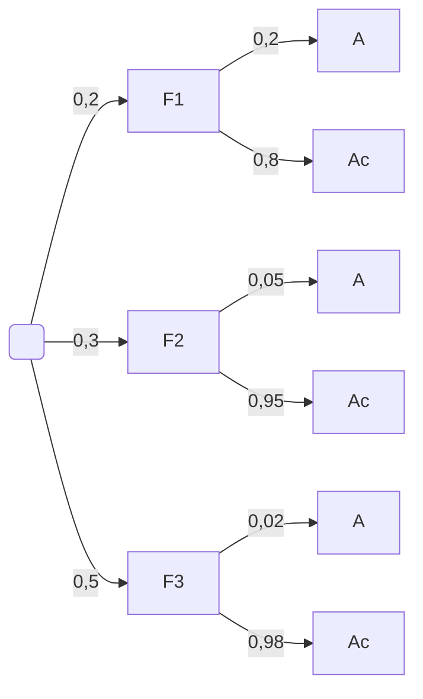

# Probabilidade

A probabilidade está diariamente presente em nossas vidas: “Será que vai chover?” e “Quem vai ganhar as eleições?” são algumas das várias perguntas que nos fazemos que envolve o cálculo de probabilidades.

O conceito de probabilidade é fundamental para o estudo de situações onde os
resultados são variáveis, isto é, situações em que os resultados possíveis são
conhecidos, mas não se pode saber a priori qual deles ocorrerá.

Os gestores freqüentemente fundamentam suas decisões em uma análise de incertezas, como:

- o Quais são as chances de queda das vendas se aumentarmos os preços?
- o Qual é a chance de um novo investimento ser lucrativo?
- o Qual é a probabilidade do projeto ser concluído no prazo?

!!! question  O que é a probabilidade?
    A probabilidade é uma medida numérica da possibilidade de um evento ocorrer. Valores probabilísticos são sempre atribuídos em uma escala de 0 a 1. Uma probabilidade próxima de 0 indica que é pouco provável que um evento ocorra; uma probabilidade próxima de 1 revela que a ocorrência de um evento é quase certa.

## Experimento aleatório

São aqueles experimentos cujos resultados podem não ser os mesmos, ainda que
sejam repetidos sob condições essencialmente idênticas. Além disso, não se conhece
um particular valor do experimento “a priori", porém podem-se descrever todos os
possíveis resultados, as possibilidades. Quando o experimento for repetido um grande
número de vezes surgirá uma regularidade.

Exemplos:

- E 1 : Lançamento de um dado e observar a face superior.
- E 2 :Lançamento de uma moeda quatro vezes e observar o número de caras.
- E 3 : Acompanhar os 30 alunos matriculados na disciplina e observar o número de aprovados.
- E 4 : Ligar uma lâmpada nova e observar o seu tempo de duração (em minutos).

## Espaço amostral

Chama-se espaço amostral o conjunto de todos os possíveis resultados de um
experimento aleatório ou, em outras palavras, é o conjunto universo relativo aos
resultados de um experimento.

Geralmente esse conjunto é representado pela letra . Assim, pode-se dizer que, a
cada experimento aleatório, sempre estará associado um conjunto de resultados
possíveis ou espaço amostral.

Aos experimentos aleatórios exemplificados anteriormente estão associados os
seguintes espaços amostrais, respectivamente:

- $\Omega_1 = \{ 1, 2, 3, 4, 5, 6 \}$
- $\Omega_2 = \{ 0, 1, 2, 3, 4 \}$
- $\Omega_3 = \{ 0, 1, 2, ... 28, 29, 30 \}$
- $\Omega_4 = \{ t \in \mathbb{R} | \geq 0 \}$

## Evento

É um subconjunto de elementos do espaço amostral.

Aos espaços amostrais exemplificados anteriormente estão associados os seguintes
eventos, respectivamente:

- $A_1$ = { 2, 4, 6 }, ou seja, obter uma face par.
- $B_2$ = { 2 }, ou seja, obter duas caras.
- $C_3$ = { 24, 25, 26, 27, 28, 29, 30 }, ou seja, pelo menos 80% de alunos aprovados na disciplina.
- $D_4$ = { t $\geq$ 10000 }, ou seja, a lâmpada durar pelo menos 10000 minutos.

## Axiiomas da Probabilidade

Dado um espaço amostral, Ω, suponha que estamos estudando um evento A. A
probabilidade do evento A ocorrer é denotada por P(A). A função P(A) só será uma
probabilidade se ela satisfaz três condições básicas:

- 0 < P(A) < 1
- P(Ω) = 1
- P(A 1  A 2  A 3 ...) = P(A 1 )+P(A 2 )+P(A 3 )+..., se os eventos A 1 , A 2 ,... forem disjuntos (isto é, mutuamente exclusivos).

## Como atribuir probabilidades aos elementos do espaço amostral?

Existem várias maneiras de se atribuir probabilidades aos elementos do espaço
amostral, dentre elas, vamos citar:

Por meio das características teóricas do experimento (Visão clássica): Seja E um
experimento e Ω um espaço amostral, a ele associado, composto de n pontos
amostrais. Define-se a probabilidade da ocorrência de um evento A, indicada por P(A),
como sendo a relação entre o número de pontos favoráveis (f) à realização do evento
A e o número total de pontos (n), ou seja:

$$
P(A)= \frac{\text{Número de casos favoráveis}}{\text{Número de casos possíveis}}
$$

Por exemplo, ao lançarmos uma moeda equilibrada sabemos que, teoricamente, cada
face tem a mesma probabilidade de ocorrência, isto é, P(C) = P($\bar{C}$) = ½.

Por meio das freqüências de ocorrências (Visão frequentista): Se o fenômeno sob análise
puder ser repetido: indefinidamente, nas mesmas condições e de forma independente (sem
que uma repetição afete a seguinte), então, se A é um evento de interesse, a probabilidade
de ocorrência de A é dada por:

$$
P(A)= \frac{\text{Número de vezes que A ocorreu}}{\text{Número total de repetições do experimento}}
$$

Exemplo 1 : De acordo com o IBGE (1988), a distribuição dos suicídios
ocorridos no Brasil em 1986, segundo a causa atribuída foi a seguinte:

| Causa do suicídio          | Freqüência |
| -------------------------- | ---------- |
| Alcoolismo (A)             | 263        |
| Dificuldade financeira (F) | 198        |
| Doença mental (M)          | 700        |
| Outro tipo de doença (O)   | 189        |
| Desilusão amorosa (D)      | 416        |
| Outras causas (C)          | 217        |
| Total                      | 1983       |

Ao selecionarmos aleatoriamente uma das pessoas que tentaram suicídio,
determine a probabilidade de que a causa atribuída tenha sido:
Desilusão amorosa:

$$
P(D)= \frac{416}{1983}=0,2097
$$

Doença mental:

$$
P(D)= \frac{700}{1983}=0,3530
$$

## Intercessão de eventos

A interseção de dois eventos A e B corresponde à ocorrência simultânea dos eventos A e
B. Contém todos os pontos do espaço amostral comuns a A e B. É denotada por A  B. A
interseção é ilustrada pela área hachurada do diagrama de Venn abaixo.

### Eventos disjuntos ou mutuamente exclusivos

Dois eventos A e B são chamados disjuntos ou mutuamente exclusivos quando não
puderem ocorrer juntos, ou seja, quando não têm elementos em comum, isto é, A  B =.
O diagrama de Venn a seguir ilustra esta situação.

## União de eventos

A união dos eventos A e B equivale à ocorrência de A, ou de B, ou de ambos, ou seja, a
ocorrência de pelo menos um dos eventos A ou B. É denotada por A  B. A área
hachurada na figura abaixo ilustra esta situação.

Para encontrar a união de dois eventos deve-se utilizar a seguinte fórmula:

P(A $\cup$ B) = P(A) + P(B) – P(A $\cap$ B)

## Complementares

Dois eventos A e B são complementares se sua união corresponde ao espaço amostral e
sua interseção é vazia. O diagrama a seguir ilustra tal situação.

o Para dois eventos A e B serem complementares: A $\cup$ B = $\Omega$ e A $\cap$ B = $\emptyset$.
Além disso, AC = B e BC = A, ou seja, o complementar do evento A ocorre
quando o evento A não ocorrer!
o Pode-se observar também que: P(A) = 1- P(B) e que P(AC) = P(B) =1 – P(A).

Exemplo: Estudo da relação entre o hábito de fumar e a causa da morte, entre 1000 empresários.

| Fumante     | Câncer (C) | Doença Cardíaca(D) | Outros (O) | Total |
| ----------- | ---------- | ------------------ | ---------- | ----- |
| Sim (F)     | 135        | 310                | 205        | 650   |
| Não ($F^c$) | 55         | 155                | 140        | 350   |
| Total       | 190        | 465                | 345        | 1000  |

Um indivíduo é selecionado aleatoriamente entre os observados na amostra.
Determine as seguintes probabilidades:

- a. Ser fumante.
  $$
  P(F)=\frac{650}{1000}=0,65
  $$
- b. Ter morrido de câncer.
  $$
  P(C)=\frac{190}{1000}=0,019
  $$
- c. Não ser fumante e ter morrido de doença cardíaca.
  $$
  P(F^c \cap D)=\frac{155}{1000}=0,155
  $$
- d. Ser fumante ou ter morrido de outras causas.
  $$
  P(F \cup O)=P(F)+P(O)-P(F \cap O)=\frac{650 + 345 +205}{1000}=0,790
  $$

### Probabilidade condicional

Em diversas situações práticas, a probabilidade de ocorrência de um evento A se
modifica quando dispomos de informação sobre a ocorrência de um outro evento
associado.
A probabilidade condicional de A dado B é a probabilidade de ocorrência do evento A,
sabido que o evento B já ocorreu. Pode ser determinada dividindo-se a probabilidade
de ocorrência de ambos os eventos A e B pela probabilidade de ocorrência do evento
B, como é mostrado a seguir:

$$
P(A | B)=\frac{P(A \cap B)}{P(B)}, P(B) > 0
$$

Da definição de probabilidade condicional, deduzimos a regra do produto de
probabilidades que é uma relação bastante útil:

$$
P(A \cap B)=P(A | B) . P(B), P(B) > 0
$$

## Independência de eventos

Dois eventos A e B são independentes se a ocorrência de um deles não afeta a
probabilidade de ocorrência do outro, ou seja, $P(A|B)=P(A) e P(B|A)=P(B)$.
Se dois eventos A e B são independentes então $P(A \cap B)=P(A).P(B)$.

Exemplo: Estudo da relação entre o criminoso e a vítima

| Criminoso     | Homicídio (H) | Furto (F) | Assalto (A) | Total |
| ------------- | ------------- | --------- | ----------- | ----- |
| Estranho (E)  | 12            | 379       | 727         | 1118  |
| Conhecido (C) | 39            | 106       | 642         | 787   |
| Ignorado (I)  | 18            | 20        | 57          | 95    |
| Total         | 69            | 505       | 1426        | 2000  |

Se uma pessoa é escolhida ao acaso entre os estudados na amostra. Determine as
probabilidades de:

- a. Ter sofrido um homicídio ou ter sido vítima de um estranho.
  $$
  P(H \cup E)=P(H)+P(E)-P(H \cap E) = \frac{69+1118+12}{2000}=0,587
  $$
- b. Dado que a pessoa sofreu um assalto, ter sido vítima de um conhecido.
  $$
  P(C | A)=\frac{P(C \cap A)}{P(A)}=\frac{^{642}/_{2000}}{^{1426}/_{2000}}=0,450
  $$
- c. A pessoa ter sofrido um furto, dado que ela foi vítima de um estranho.
  $$
  P(F | E) = \frac{P(F \cap E)}{P(E)}=\frac{379}{1118}=0,338
  $$

## Teorema da probabilidade total

Sejam $A_1 , A_2 , A_3 ...$ An eventos dois a dois disjuntos que formam uma partição do espaço
amostral, isto é,

$$
\bigcup_{i=1}^{n} A_i= \Omega
$$

e assuma que P($A_i$)>0 para i=1, 2, 3,...n. Então, para qualquer evento , temos que

$$
P(B) = P(A_1 \cap B) + P(A_2 \cap B) + ...+ P(A_n \cap B)
$$

Aplicando a regra do produto temos
$$
P(B) = P(A_1 \cap B) + P(A_2 \cap B) + ...+ P(A_n \cap B)
\\
P(B) = \sum_{i} P(A_i)P(B|A_i)
$$

## Teorema de Bayes eu uso da árvore de probabilidades

Sejam $A_1 , A_2 , A_3 ...$ An eventos que formam uma partição do espaço amostral, e assuma
que P($A_i$)>0 para todo i. Então, para qualquer evento B tal que P(B)>0, temos que

$$
P(A_i \mid B) = \frac{P(A_i \cap B)}{P(B)} =\frac{P(A_i) \cdot P(B \mid A_i)}{\sum_{j=1}^n P(A_j) \cdot P(B \mid A_j)}
$$

Para verificar o teorema de Bayes, basta notar que $P(A_i \cap B)=P(B \cap A_i)$ e que, por sua
vez, $P(B|A_i) . P(A_i)=P(A_i|b).P(B)$, o que garante o numerador. O denominador segue da aplicação do teorema da probabilidade total para B.

A árvore de probabilidades é um diagrama que consiste em representar os eventos e as
probabilidades condicionais associadas às realizações. Cada um dos caminhos da árvore
indica uma possível ocorrência ou interseção de eventos.

Exemplo: Suponha que você é o gerente de uma fábrica de sorvetes. Você sabe
que 20% de todo o leite que utiliza na fabricação dos sorvetes provém da fazenda
F 1 , 30% são de uma outra fazenda F 2 e 50% de uma fazenda F 3. Um órgão de
fiscalização inspecionou as fazendas de surpresa, e observou que 20% do leite
produzido por F 1 estava adulterado por adição de água, enquanto que para F 2 e F 3 ,
essa proporção era de 5% e 2%, respectivamente. Na indústria de sorvetes que
você gerencia os galões de leite são armazenados em um refrigerador sem
identificação das fazendas. Para um galão escolhido ao acaso, calcule:

- a. A probabilidade de que o galão contenha leite adulterado.
- b. A probabilidade de que o galão tenha vindo da fazenda F 3 , sabendo que contém leite não adulterado.

> Resolução:

Observe que o diagrama de Venn a seguir ilustra os três eventos associados as
fazendas (F 1 , F 2 e F 3 ) e ao leite adulterado (A) ou não adulterado (Ac):

Se denotarmos por A o evento “o leite está adulterado”, temos que P(A|F 1 )=0,20,
P(A|F 2 )=0,05 e P(A|F 3 )=0,02. Além disso, a probabilidade do leite ser produzido por
cada uma das fazendas (F 1 , F 2 e F 3 ) é denotada por P(F 1 )=0,2, P(F 2 )=0,3 e
P(F 3 )=0,5. A partir daí, podemos construir a árvore de probabilidades da seguinte
maneira:

- a.
  $$
  P(A)=P(F_1 \cap A) + P(F_2 \cap A) + P(F_3 \cap A)=\\
  [P(A|F_1).P(F_1)]+[P(A|F_2).P(F_2)]+[P(A|F_3).P(F_3)]=\\
  (0,2 \cdot 0,2)+(0,05 \cdot 0,3)+(0,02 \cdot 0,5)=0,065
  $$
- b.
  $$
  P(F_3|A^c)=\frac{P(F_3 \cap A^C)}{P(A^C)}=\frac{P(A^C|F_3).P(F_3)}{1-P(A)}=\frac{0.98 \cdot 0.5}{1-0,065}=0,5241
  $$
