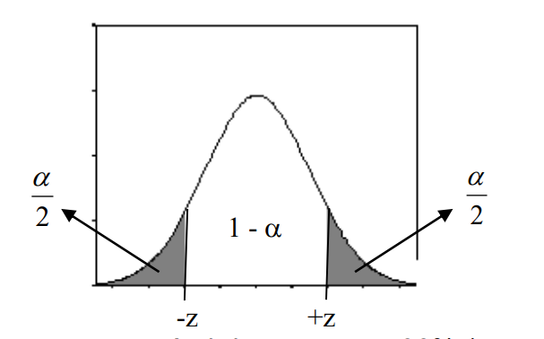
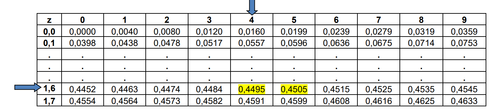
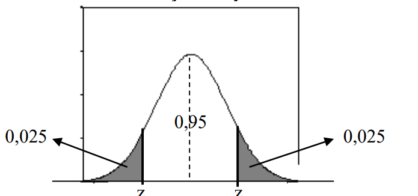

# Inferência Estatística

## Estimação de parametros estatisticos

A estimação é o processo que consiste em utilizar dados amostrais para estimar os 
valores de parâmetros populacionais desconhecidos. Essencialmente, qualquer 
característica de uma população pode ser estimada a partir de uma amostra aleatória. 
Entre os estimadores mais comuns estão a média amostral ($\bar{x}$), o desvio padrão amostral (s) e a proporção amostral ($\hat{p}$) como estimadores da média populacional ($\mu$), do desvio padrão populacional ($\sigma$) e da proporção populacional (p), respectivamente.

## Estimativa pontual

As estatísticas amostrais são utilizadas como estimadores de parâmetros 
populacionais. A **estimativa é pontual** quando a estatística amostral origina uma única 
estimativa do parâmetro, ou seja, um único valor para o parâmetro populacional que se 
quer estimar, como, por exemplo:

- Parâmetro populacional: $\mu$
- Estimador:
  >  $$
  >  \bar{x} = \frac{\sum_{i=1}^{n} x_i}{n}
  >  $$
- Parâmetro populacional: $\sigma$
- Estimador:
  > $$
  > s = \sqrt{\frac{\sum_{i=1}^{n} (x_i - \bar{x})^2}{n-1}}
  > $$
- Parâmetro populacional: p
- Estimador:
  > $$
  > \hat{p} = \frac{x}{n} = \frac{\text{nº de itens na amostra que apresenta característica de interesse}}{\text{tamanho da amostra}}
  > $$

## Estimativa intervalar ou Intervalo de confiança

A **estimativa é intervalar** quando, a partir da estatística amostral, construímos 
um intervalo de valores possíveis no qual se admite, sob certa probabilidade, esteja 
contido o parâmetro populacional.

Um intervalo de confiança está associado a um grau de confiança que é uma 
medida da nossa certeza de que o intervalo contém o parâmetro populacional.

O **grau de confiança** é a probabilidade 1 - $\alpha$ de o intervalo de confiança conter o verdadeiro valor do parâmetro populacional (o grau de confiança é também chamado de nível de confiança ou de coeficiente de confiança). A definição de grau de confiança utiliza $\sigma$ para descrever uma probabilidade que corresponde a uma área. Observe a figura abaixo:

São escolhas comuns para o nível de confiança: 90% (com $\alpha$=0,10), 95% (com 
$\alpha$=0,05) e 99% (com $\alpha$=0,01). A mais comum é a opção 95%, porque proporciona um bom equilíbrio entre a precisão (refletida na amplitude do intervalo de confiança) e a confiabilidade (expressa pelo grau de confiança).

Quanto maior o nível de confiança, maior será a amplitude do intervalo. Dado 
um nível de confiança, quanto maior for o intervalo, menos informação teremos sobre o verdadeiro valor do parâmetro populacional.

A interpretação de um intervalo de confiança é que se um número infinito de 
amostras aleatórias for coletado e um intervalo com 100(1-$\alpha$)% de confiança para o parâmetro for calculado a partir de cada amostra, então 100(1-$\alpha$)% desses intervalos conterão o valor verdadeiro do parâmetro. 

Na prática, obtemos somente uma amostra aleatória e calculamos o intervalo de 
confiança. Uma vez que este intervalo conterá ou não o valor verdadeiro do parâmetro, não é razoável fixar um nível de probabilidade a esse evento específico. A afirmação apropriada é: o intervalo observado contém o valor verdadeiro do parâmetro, com 100(1-$\alpha$)% de confiança.

## Intervalo de confiança para a médiaquando $\sigma$ é conhecido

Observe o exemplo a seguir:

### Exemplo 1

(Barbetta, 2004) Em uma indústria de cerveja, a quantidade de cerveja inserida em 
latas tem-se comportado como uma variável aleatória distribuída normalmente com média 350 ml e desvio padrão 3 ml. Após alguns problemas na linha de produção, suspeita-se que houve alteração na média. Uma amostra de 120 latas acusou média 346 ml. Encontre a estimativa pontual e construa um intervalo de confiança para o novo valor da quantidade média de cerveja inserida em latas, com nível de confiança de 95%, supondo que não tenha ocorrido alteração no desvio padrão do processo.

A média amostral ($\bar{x}$) é a melhor estimativa pontual da média populacional ($\mu$), com base nos dados amostrais vemos que a melhor estimativa para a quantidade média 
de cerveja inserida nas latas, após os problemas na linha de produção, é 346ml.

Para construirmos o intervalo de confiança desejado é necessário analisar o 
seguinte: Pelo Teorema Central do Limite, sabemos que as médias amostrais tendem a 
distribuir-se normalmente, além disso, foi-nos fornecido no enunciado do problema o valor do desvio padrão da população ($\sigma$ = 3 ml). Dessa maneira, para encontrarmos o intervalo de confiança para a média vamos utilizar a distribuição normal:

| Parâmetro populacional | Suposição                                          | Intervalo de confiança                                                           |
| ---------------------- | -------------------------------------------------- | -------------------------------------------------------------------------------- |
| $\mu$                  | Desvio padrão populacional ($\sigma$) é conhecido. | $\left[ \bar{x} \pm z_{\frac{\alpha}{2}} \times \frac{\sigma}{\sqrt{n}} \right]$ |

O valor $z_{\frac{\alpha}{2}}$ é chamado valor crítico porque está na fronteira que separa as médias amostrais passíveis de ocorrerem, das médias amostrais que provavelmente não ocorrerão. Ele é obtido pela tabela da distribuição normal padrão de acordo com a área desejada.
Para os níveis de confiança mais utilizados, os valores críticos ($z_{\frac{\alpha}{2}}$) obtidos na tabela da distribuição normal padrão são:

| Grau de confiança | $\sigma$ | Valor crítico $z_{\frac{\alpha}{2}}$ |
| ----------------- | -------- | ------------------------------------ |
| 90%               | 0,10     | 1,64                                 |
| 95%               | 0,05     | 1,96                                 |
| 99%               | 0,01     | 2,58                                 |

Para encontrar os valores críticos na tabela da distribuição normal padrão é 
necessário dividir o nível de confiança por 2 , o resultado deve ser localizado no meio da 
tabela, cruzando-se os valores da linha e da coluna da tabela teremos os valores críticos. 
Veja um exemplo: Para um nível de confiança igual a 90%, devemos dividi-lo por 2, ou 
seja, teríamos 45% ou 0,45. Vamos buscar no meio da Tabela da Distribuição Normal 
Padrão o valor mais próximo de 0,45:

Ambos os valores 0,4495 e 0,4505 estão igualmente próximos a 0,45, dessa 
forma, optamos por utilizar o valor crítico 1,64 correspondente a probabilidade 0,4495.

Quando utilizamos dados amostrais para estimar uma média populacional $\mu$, a 
**margem de erro**, denotada por E, é a diferença máxima provável (com probabilidade 1 - $\alpha$) entre a média amostral observada $\bar{x}$ e a verdadeira média populacional $\mu$. A margem 
de erro é chamada também de erro máximo da estimativa e pode ser obtida multiplicando-se o valor crítico ( $z_{\frac{\alpha}{2}}$) pelo desvio-padrão das médias amostrais ($\frac{\sigma}{\sqrt{n}}$), conforme a fórmula a seguir:

$$
E = z_{\frac{\alpha}{2}} . \frac{\sigma}{\sqrt{n}}
$$

Voltando ao exemplo, temos:

- $\bar{x}$ = 346
- n = 120
- $\sigma$ = 3
- Nível de confiança = 95%
- $\alpha$ = 0,05

O intervalo de confiança desejado é:

## Resumo 

1. **Inferência Estatística:** A área estuda a estimativa de parâmetros populacionais a partir de uma amostra.
2. **Parâmetros Populacionais:** Medidas como média, variância, desvio padrão e proporção calculadas a partir de uma população.
3. **Estimação de Parâmetros:** É o processo de estimar valores populacionais, como média e proporção, com base em uma amostra quando o estudo populacional completo não é possível.
4. **Estimativa Pontual:** Um valor único que representa uma medida da amostra, como média, variância ou proporção.
5. **Estimativa Intervalar:** Cria-se um intervalo ao redor da estimativa pontual, considerando que os valores podem variar dependendo da amostra, aumentando a confiança no resultado.
6. **Nível de Confiança:** Utilizado na estimativa intervalar para determinar a variação possível dos valores estimados.

**Fatos importantes enumerados:**
1. Inferência estatística permite estimar e modelar características de uma população.
2. Parâmetros são obtidos de populações, enquanto estatísticas vêm de amostras.
3. Estimativa pontual dá um valor específico da amostra para estimar a população.
4. Estimativa intervalar fornece um intervalo de variação com base em amostras diferentes.
5. O nível de confiança é usado para construir estimativas intervalares./////???????////////?????????////???????